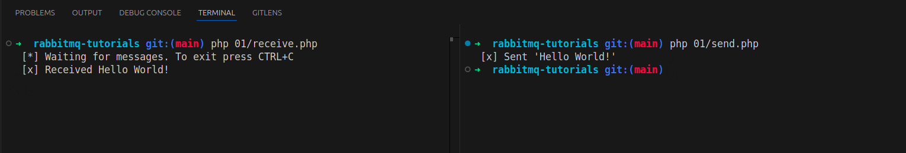

# RabbitMQ Tutorials

Este repositório contém uma série de testes e estudos relacionados ao RabbitMQ, focando na seção de "Queues Tutorials" disponível em [RabbitMQ Tutorials](https://www.rabbitmq.com/tutorials). O objetivo é explorar e implementar os conceitos básicos de filas utilizando a linguagem PHP.



**Tecnologias Utilizadas:**


## Estrutura do Projeto

- **Testes de Conexão**: Exemplos de como estabelecer uma conexão com o RabbitMQ.
- **Publicadores e Consumidores**: Implementações que demonstram como enviar e receber mensagens através de filas.
- **Gerenciamento de Filas**: Exemplos de como criar, listar e manipular filas no RabbitMQ.
- **Exchanges**: Implementações que demonstram a criação e configuração de exchanges.
- **Tratamento de Erros**: Abordagens para lidar com falhas na comunicação e no processamento de mensagens.

## Para Desenvolvedores

Se você é um desenvolvedor interessado em contribuir ou entender melhor o funcionamento do projeto, aqui estão algumas informações adicionais:

<br>

**Requisitos de Instalação:**
- Composer - `2.5.5`
- PHP - `7.4.33`

<br>

**Instruções de Instalação:**
1. Clone o repositório do projeto:
```
git clone https://github.com/edssaac/rabbitmq-tutorials
```

2. Navegue até o diretório do projeto:
```
cd rabbitmq-tutorials
```

3. Configure o Composer:
```
composer install
```

<br>

**Como Executar:**

Após concluir as etapas de instalação, você está pronto para colocar a aplicação em funcionamento. Siga os passos abaixo para testar o envio e recebimento de mensagens usando RabbitMQ:

1. Para facilitar o acompanhamento, abra dois terminais lado a lado. Isso permitirá que você visualize a interação entre o consumidor e o publicador.

2. Em um dos terminais, inicie o script que irá consumir as mensagens. Execute o seguinte comando:
   ```
   php 01/receive.php
   ```
   Este script ficará escutando por mensagens que serão enviadas.

3. No segundo terminal, execute o script responsável por publicar as mensagens:
   ```
   php 01/send.php
   ```
   Ao rodar este script, você começará a enviar mensagens para o consumidor.

Pronto! Agora você está testando seu primeiro exemplo. Os demais exemplos seguirão uma estrutura semelhante, apenas preste atenção ao nome dos scripts correspondentes.

## Contato

[](https://github.com/edssaac)
[](mailto:edssaac@gmail.com)
[](mailto:edssaac@outlook.com)
[](https://www.linkedin.com/in/edssaac/)
